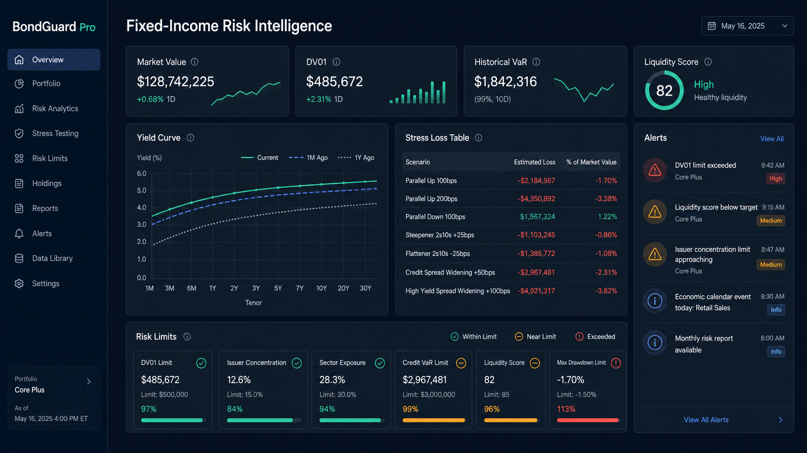

# BondGuard Pro

### Integrated fixed-income portfolio risk analytics platform

BondGuard Pro is a full-stack application for analysing fixed-income portfolios and operating the surrounding risk-control workflow. It combines deterministic bond valuation, market and liquidity risk, stress testing, limit monitoring, breach management, data-quality controls, and executive reporting in one auditable product.



## Why it stands out

Most finance projects demonstrate a metric or a dashboard. BondGuard Pro demonstrates the system around the metric: reliable data ingestion, model-quality gates, a reproducible valuation engine, governed risk limits, permission-aware workflows, audit events, and a usable analytical interface.

It is built as an institutional-style engineering portfolio project—not a claim of production regulatory readiness. The repository is explicit about its data, model, and operational limitations.

## Product flow

```text
FRED / yfinance market data
            │
            ▼
   Validation & quality gate
            │
            ▼
 Portfolio valuation and risk engine
            │
            ├──────────────► Market risk: VaR / ES / factor exposure
            ├──────────────► Stress & custom scenario analysis
            └──────────────► Liquidity & concentration analytics
                                     │
                                     ▼
                         Risk-limit evaluation
                                     │
                                     ▼
                   OPEN → ACKNOWLEDGED → RESOLVED
                                     │
                                     ▼
              Notifications, snapshots, and reporting
```

## What the application does

| Area | Highlights |
| --- | --- |
| Fixed-income valuation | Clean and dirty price, accrued interest, yield solving, duration, convexity, DV01, market value, and unrealized P&L |
| Market risk | Historical VaR, parametric VaR, Expected Shortfall, factor mapping, volatility, contribution, and backtesting |
| Model governance | 252-observation production baseline and an explicit `RATE_ONLY_MODEL` fallback for credit-spread data gaps |
| Stress testing | Parallel, curve, and credit-spread shocks; full revaluation and duration/convexity methods; position attribution |
| Scenario Lab | Custom scenarios, saved scenario definitions, portfolio comparison, and P&L attribution |
| Liquidity risk | Characteristic-based liquidity proxy, liquidation capacity, transaction cost, horizons, liquidity-adjusted VaR, and HHI concentration |
| Risk controls | Global and portfolio-level limits, precedence rules, evaluation history, breach deduplication, lifecycle audit trail, and notifications |
| Operations | FRED/yfinance pipeline runs, freshness/completeness checks, data-quality diagnostics, and analytics run metadata |
| Security | JWT access/refresh sessions, account lockout, RBAC, protected API routes, and permission-aware navigation |

## Dashboard experience

The React dashboard is designed for the way an analyst explores risk: choose a portfolio once, then navigate through its overview, holdings, yield curve, market risk, credit risk, liquidity, stress tests, scenarios, risk controls, reporting, and data operations.

Key screens include:

- Executive overview and portfolio drill-down
- Yield-curve, credit-risk, market-risk, and advanced-analytics views
- Stress Testing and Scenario Lab
- Liquidity Risk and Risk Intelligence
- Risk Control Center, Risk Limits, breach audit history, and notifications
- Data Monitor, Data Operations, Data Quality, analytics runs, and admin tools

## Architecture

```text
React + TypeScript + Vite + TanStack Query
                   │
                   ▼
        FastAPI REST API + JWT / RBAC
                   │
       ┌───────────┼────────────┐
       ▼           ▼            ▼
 Valuation &   Data pipeline   Risk-control
 risk engines  & quality gate  & reporting services
       │           │            │
       └───────────┴────────────┘
                   │
                   ▼
          SQLAlchemy + Alembic + PostgreSQL
```

### Technology

- Backend: Python 3.12+, FastAPI, SQLAlchemy 2.x, Alembic, PostgreSQL
- Quant: NumPy, pandas, SciPy, deterministic cash-flow and yield calculations
- Frontend: React 19, TypeScript, Vite, TanStack Query, React Router, Plotly, Recharts
- Data: FRED and yfinance adapters with persisted pipeline and quality results
- Delivery: Docker Compose and GitHub Actions for backend/frontend lint, test, and build gates

## Financial conventions

These rules are deliberately enforced across the platform:

- Quantity is face-value units.
- `market value = quantity × face value × clean price / 100`
- DV01 and VaR are returned as positive loss magnitudes.
- Treasury securities have zero CS01 by construction.
- Production VaR requires at least 252 aligned daily factor observations.
- Credit-spread history failure degrades the model visibly to `RATE_ONLY_MODEL`; it does not silently calculate a full-factor VaR.
- Risk-limit breaches are deduplicated while active: repeated observations update the same `OPEN` or `ACKNOWLEDGED` record and never revert an acknowledgement to `OPEN`.

## Repository map

```text
backend/
  app/                 FastAPI, risk engines, data pipeline, auth, reporting, models
  alembic/             Database migrations
  scripts/             Seed, ingestion, and maintenance commands
  tests/               Unit and integration tests
frontend/
  src/pages/           Analytical, governance, operations, and admin views
  src/api/             Typed API client and contracts
docs/
  architecture/        System, data-source, and reporting design notes
  domain/              Portfolio, risk, stress, and reporting methodology
  operations/          Risk-control, breach, and snapshot workflows
```

## Run locally

### Docker

```bash
cp .env.example .env
docker compose up --build
```

The frontend is available at `http://localhost:5173`; the API and OpenAPI UI are available at `http://localhost:8000` and `http://localhost:8000/api/v1/openapi.json`.

### Development setup

```bash
# Backend
cd backend
python -m venv .venv
.venv\Scripts\activate            # Windows PowerShell
pip install -r requirements.txt
alembic upgrade head
pytest

# Frontend (in another terminal)
cd frontend
npm ci
npm run dev
```

Set `FRED_API_KEY` in `.env` to enable FRED ingestion. For initial users, set `ADMIN_PASSWORD` before running the role/user seed command.

## Quality gates

```bash
# Backend
cd backend
ruff check .
pytest

# Frontend
cd frontend
npm run lint
npm run test
npm run build
```

The test database uses temporary SQLite files outside the workspace. Production configuration targets PostgreSQL through Alembic migrations.

## Documentation

| Topic | Location |
| --- | --- |
| System architecture | [docs/architecture/system_architecture.md](docs/architecture/system_architecture.md) |
| Data sources | [docs/architecture/data_sources.md](docs/architecture/data_sources.md) |
| Fixed-income risk engine | [docs/domain/risk_engine.md](docs/domain/risk_engine.md) |
| Stress testing | [docs/domain/stress_testing.md](docs/domain/stress_testing.md) |
| Risk controls | [docs/operations/risk_control.md](docs/operations/risk_control.md) |
| Breach lifecycle | [docs/operations/breach_management.md](docs/operations/breach_management.md) |
| Engineering standards | [AGENTS.md](AGENTS.md) |

## What this project demonstrates

- Quantitative finance engineering: pricing, duration/convexity, DV01/CS01, VaR/ES, liquidity, concentration, stress testing, and P&L explain
- Backend system design: REST APIs, domain services, persistence, migrations, data pipelines, authentication, authorization, reporting, and auditability
- Frontend engineering: a typed analytical UI, asynchronous server state, permission-aware routes, and data-heavy risk workflows
- Product thinking: transparent model degradation, operational monitoring, traceable breaches, and constraints stated plainly

## Scope and production considerations

BondGuard Pro is an integrated risk-platform implementation, not a replacement for institutional model validation, licensed market-data feeds, enterprise identity management, centralized observability, disaster recovery, independent price verification, or regulatory controls. Those are intentional next steps for a production deployment.
